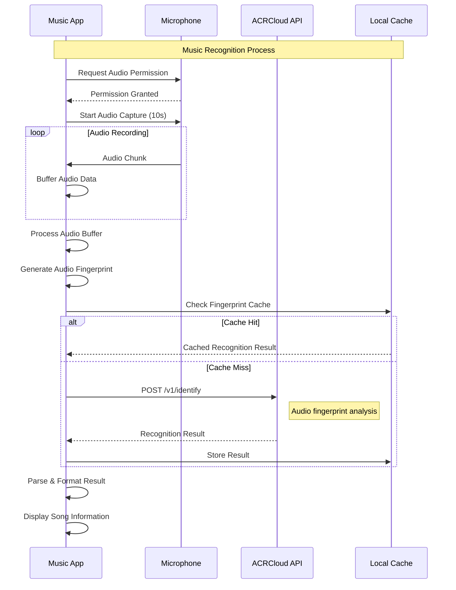
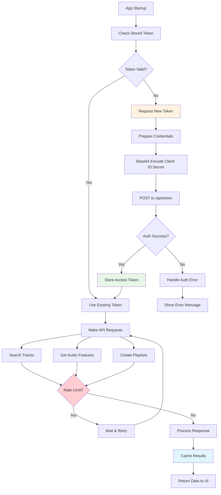
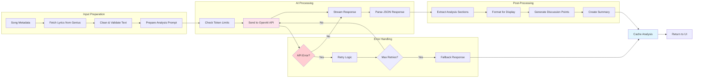
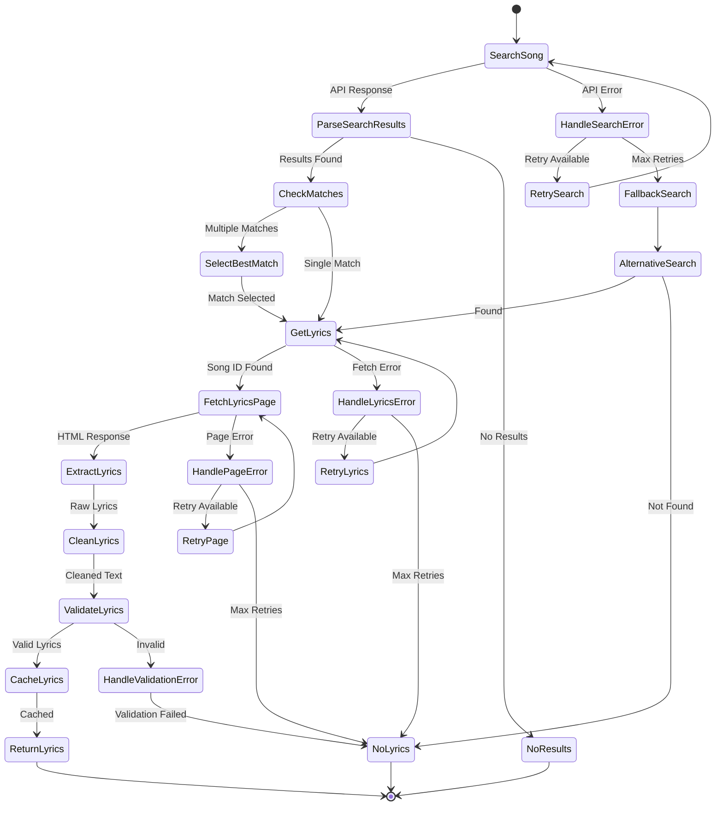
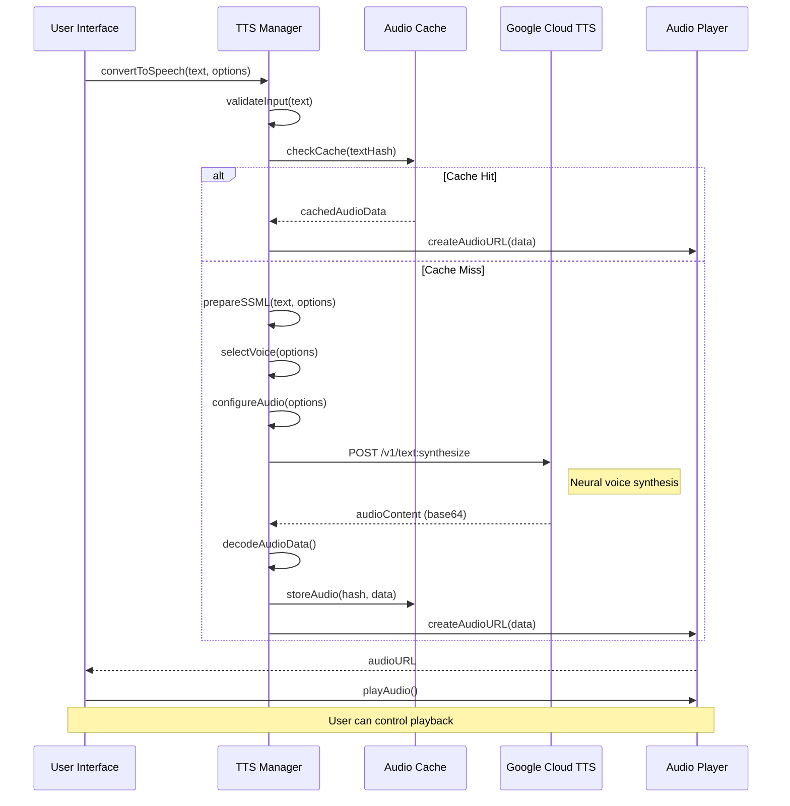
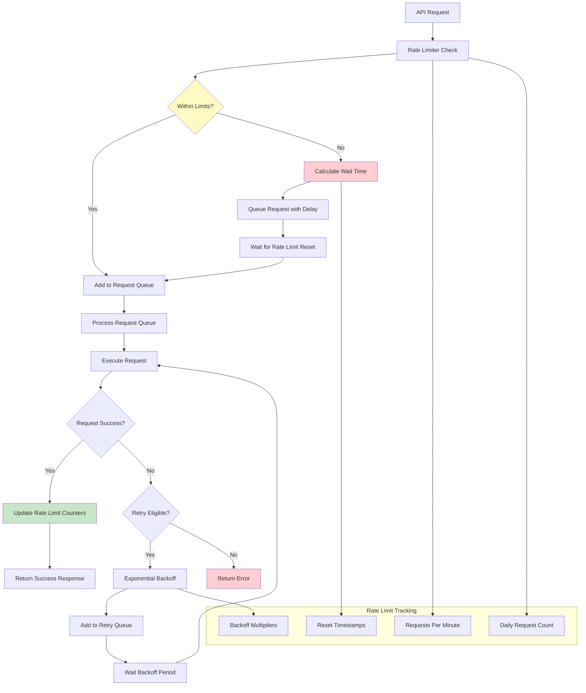
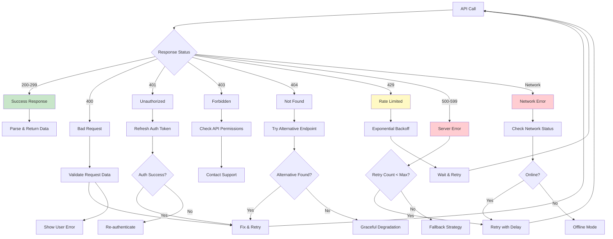
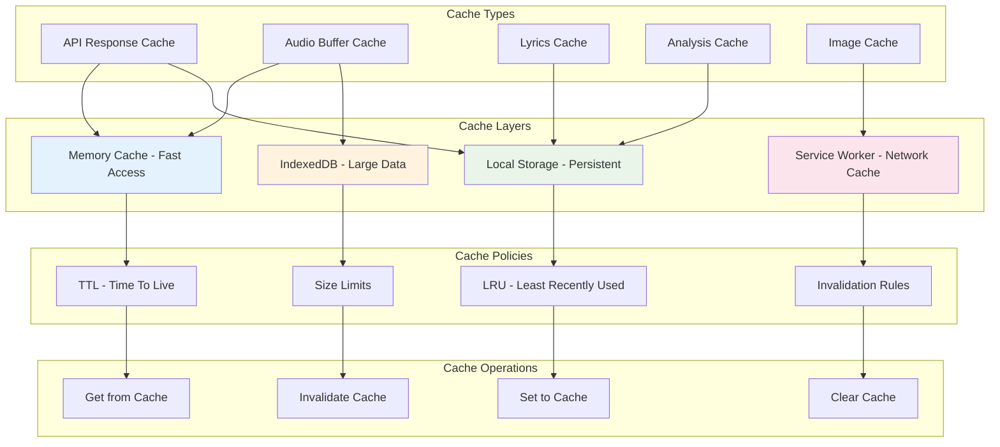
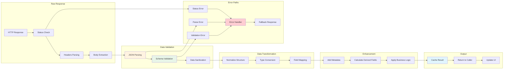

# 🔌 API Integration Flowcharts & Diagrams

## ACRCloud Music Recognition Flow

## Spotify API Authentication & Data Flow

## OpenAI GPT-4 Lyric Analysis Pipeline

## Genius API Lyrics Retrieval Process

## Google Cloud Text-to-Speech Workflow

## Rate Limiting & Request Management

## API Error Handling Strategy

## Caching Strategy Diagram

## API Response Processing Pipeline

