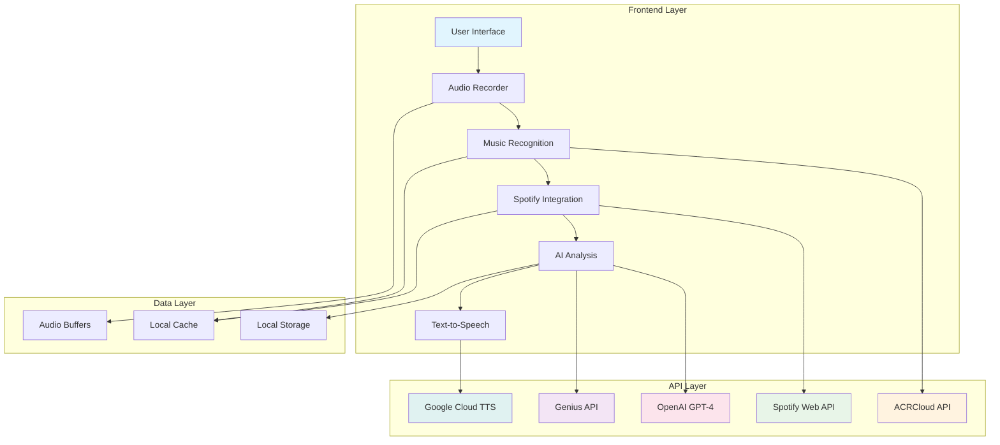
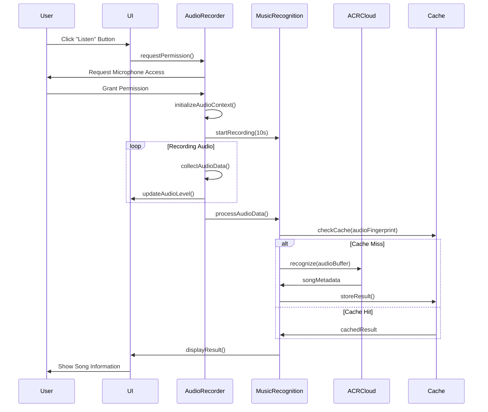
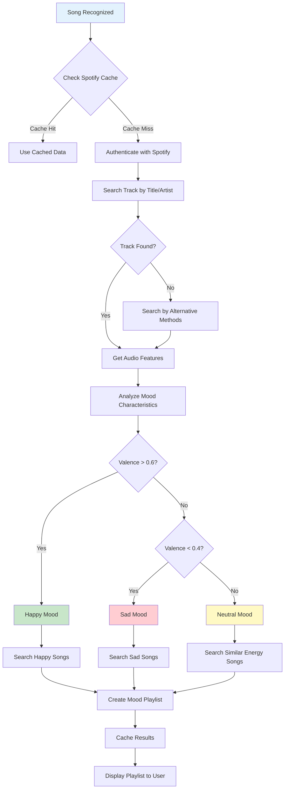
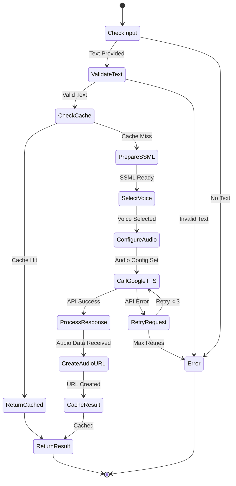
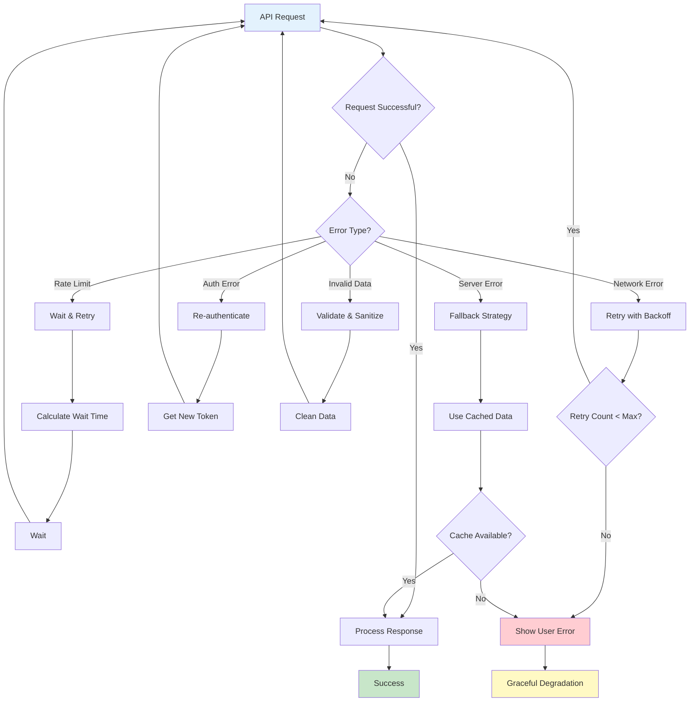
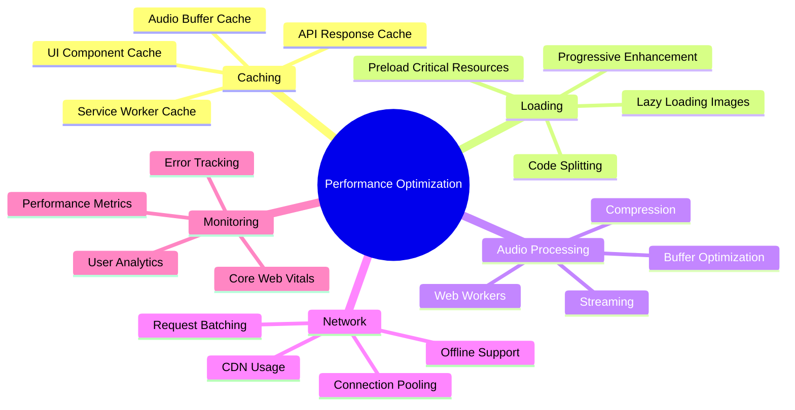
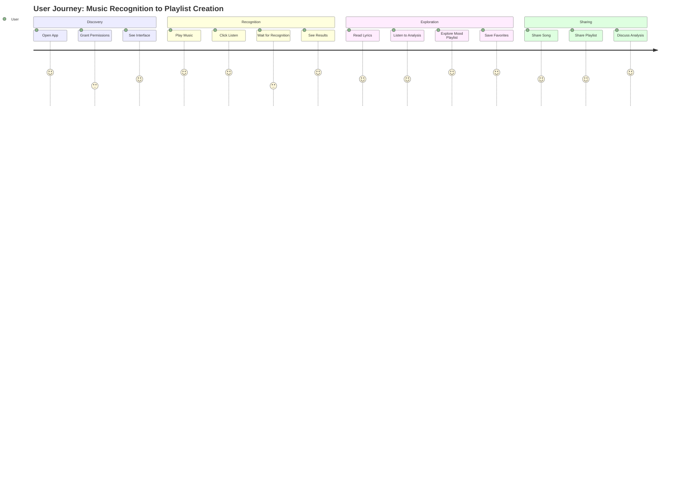
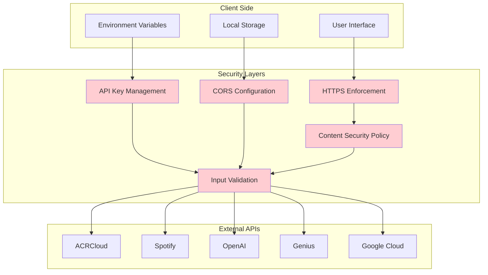

# 🎵 Music App Architecture & Workflow Diagrams

## System Architecture Overview



## Music Recognition Workflow



## Spotify Integration & Mood Playlist Creation



## AI Lyric Analysis Pipeline

```mermaid
graph LR
    subgraph "Input Processing"
        A[Song Metadata] --> B[Search Genius API]
        B --> C[Extract Lyrics]
        C --> D[Clean & Format Text]
    end
    
    subgraph "AI Analysis"
        D --> E[Prepare OpenAI Prompt]
        E --> F[Send to GPT-4]
        F --> G[Parse AI Response]
    end
    
    subgraph "Enhancement"
        G --> H[Extract Key Themes]
        H --> I[Identify Literary Devices]
        I --> J[Cultural Context Analysis]
    end
    
    subgraph "Output Generation"
        J --> K[Format Analysis]
        K --> L[Generate Discussion Points]
        L --> M[Create Summary]
    end
    
    subgraph "Delivery"
        M --> N[Cache Results]
        N --> O[Display to User]
        O --> P[Optional TTS Narration]
    end
    
    style E fill:#fff3e0
    style F fill:#fce4ec
    style P fill:#e0f2f1
```



## Text-to-Speech Processing Flow



## Error Handling & Recovery Patterns



## Performance Optimization Strategy



## User Experience Flow



## Testing Strategy Pyramid

```mermaid
graph TD
    subgraph "Testing Pyramid"
        A[Unit Tests - 70%]
        B[Integration Tests - 20%]
        C[E2E Tests - 10%]
    end
    
    subgraph "Unit Test Coverage"
        D[Audio Processing Functions]
        E[API Response Parsing]
        F[Utility Functions]
        G[Component Logic]
    end
    
    subgraph "Integration Tests"
        H[API Integrations]
        I[Audio Recording Flow]
        J[Cache Management]
        K[Error Handling]
    end
    
    subgraph "E2E Tests"
        L[Complete User Journeys]
        M[Cross-Browser Testing]
        N[Performance Testing]
        O[Accessibility Testing]
    end
    
    A --> D
    A --> E
    A --> F
    A --> G
    
    B --> H
    B --> I
    B --> J
    B --> K
    
    C --> L
    C --> M
    C --> N
    C --> O
    
    style A fill:#c8e6c9
    style B fill:#fff9c4
    style C fill:#ffcdd2
```



## Deployment Pipeline

```mermaid
gitgraph
    commit id: "Initial Setup"
    branch development
    checkout development
    commit id: "Add Music Recognition"
    commit id: "Add Spotify Integration"
    commit id: "Add AI Analysis"
    
    branch feature/tts
    checkout feature/tts
    commit id: "Implement TTS"
    commit id: "Add Voice Selection"
    
    checkout development
    merge feature/tts
    commit id: "Integration Testing"
    
    branch staging
    checkout staging
    merge development
    commit id: "Staging Deploy"
    commit id: "Performance Testing"
    
    checkout main
    merge staging
    commit id: "Production Deploy"
    commit id: "Monitor & Optimize"
```

## Security Architecture


