# ⚡ Performance Optimization & Monitoring Diagrams

## Performance Optimization Strategy Overview

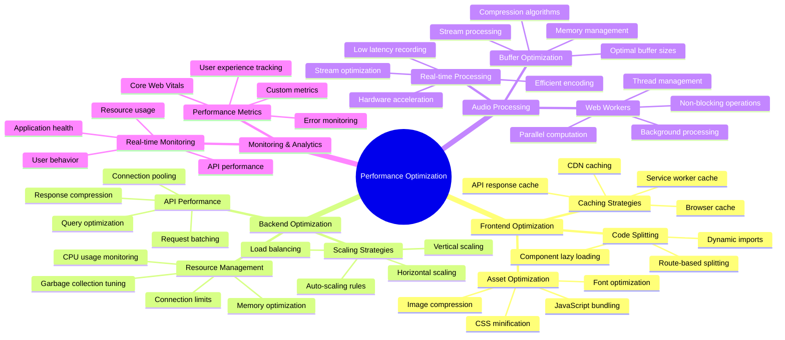

## Core Web Vitals Optimization

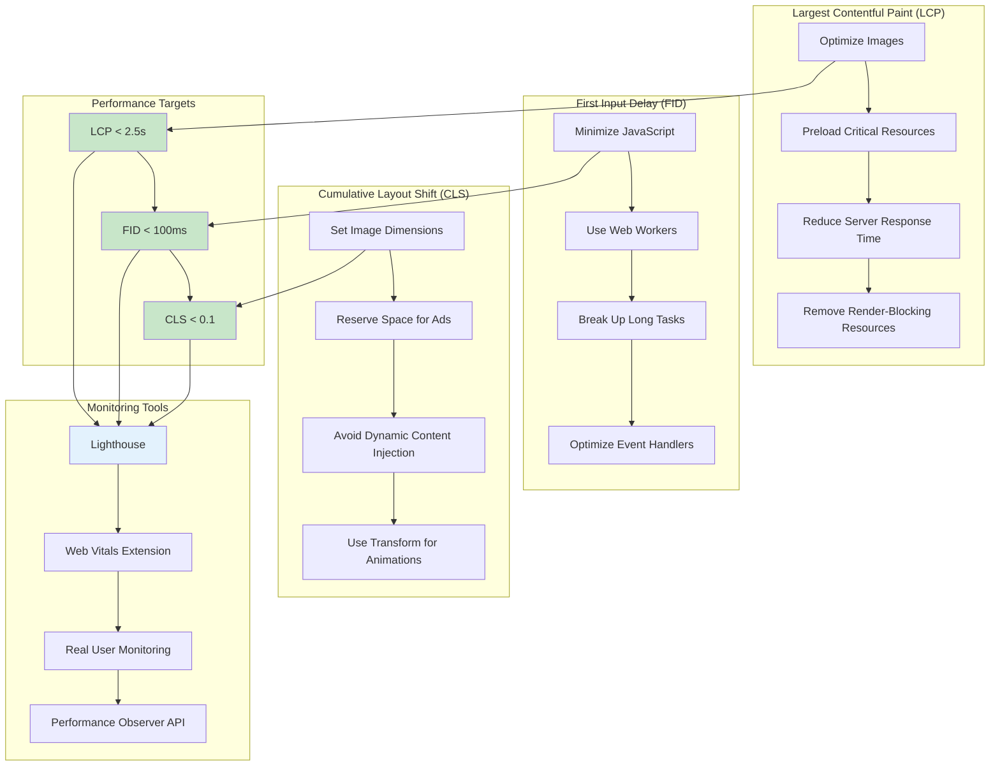

## Caching Strategy Implementation

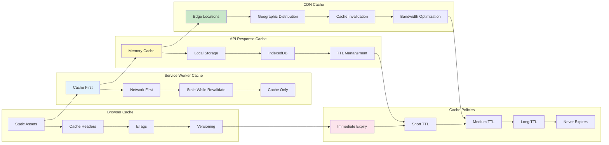

## Audio Processing Performance Pipeline

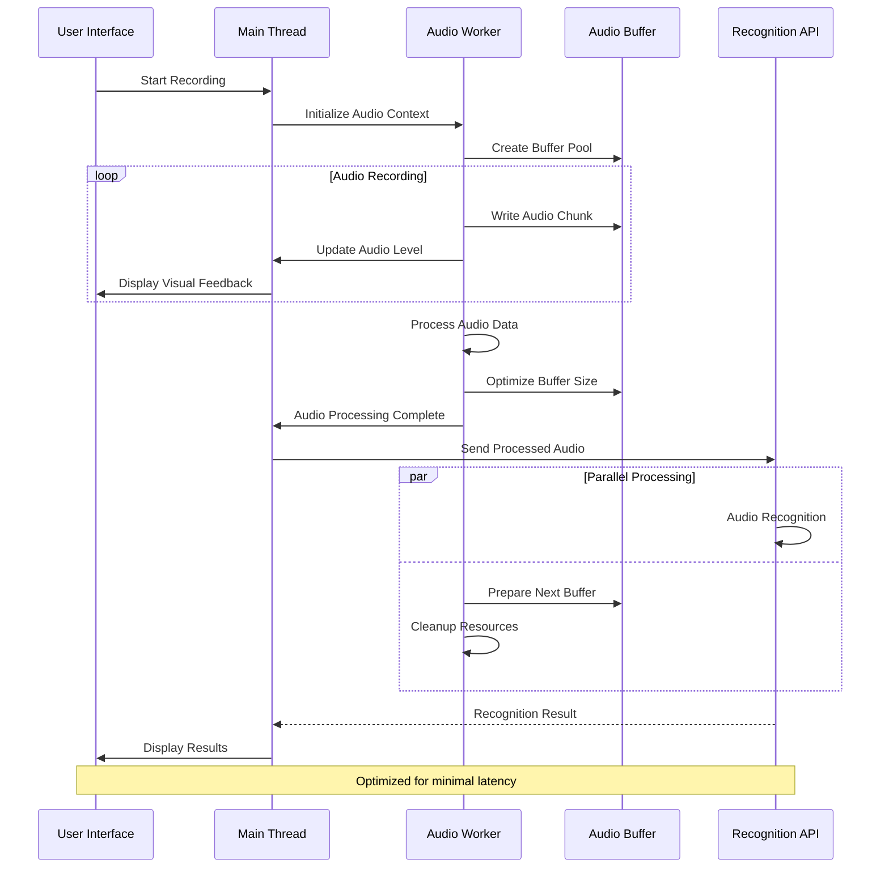

## Memory Management Strategy

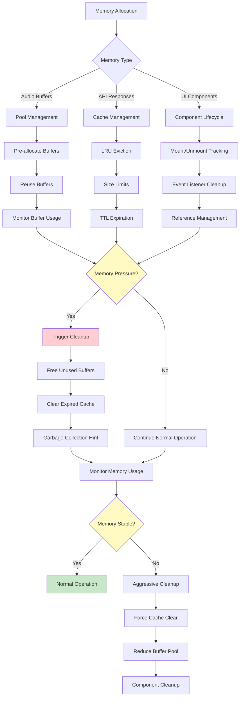

## Network Optimization Flow

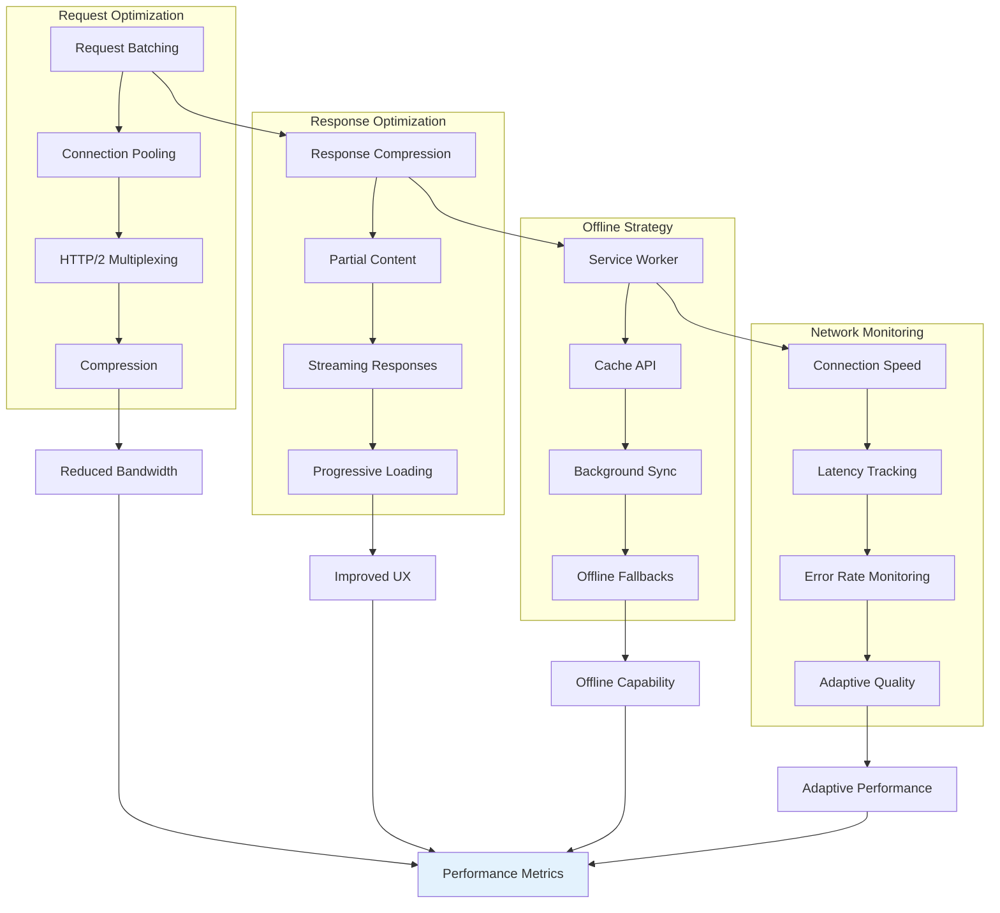

## Real-time Performance Monitoring

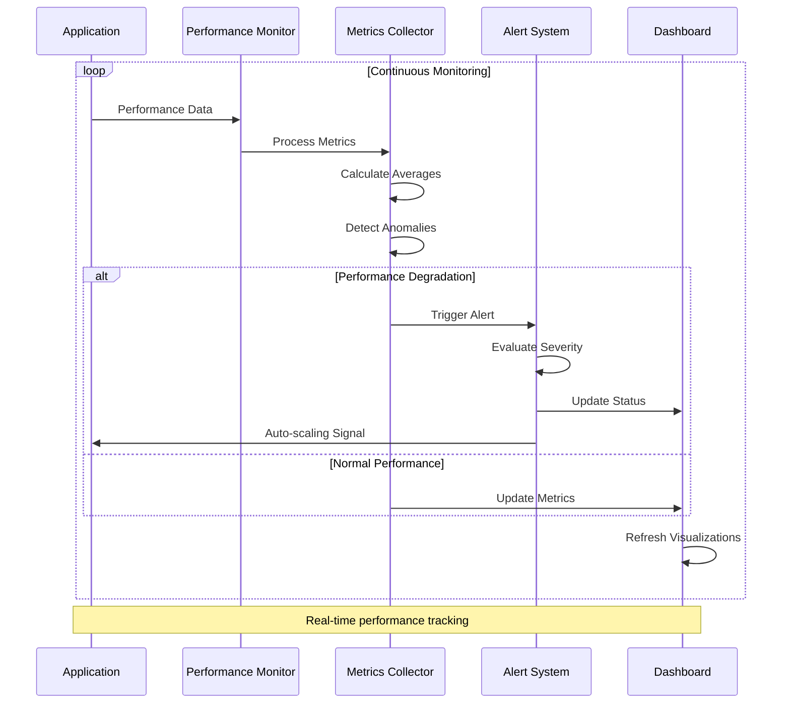

## Bundle Size Optimization

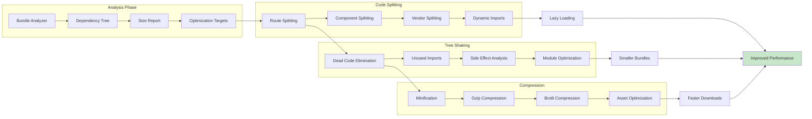

## Performance Budget Management

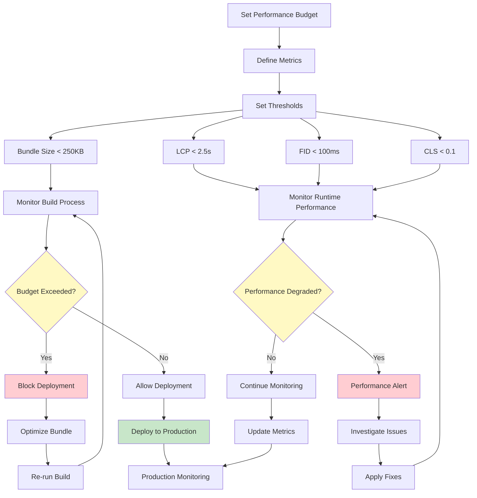

## Database Query Optimization

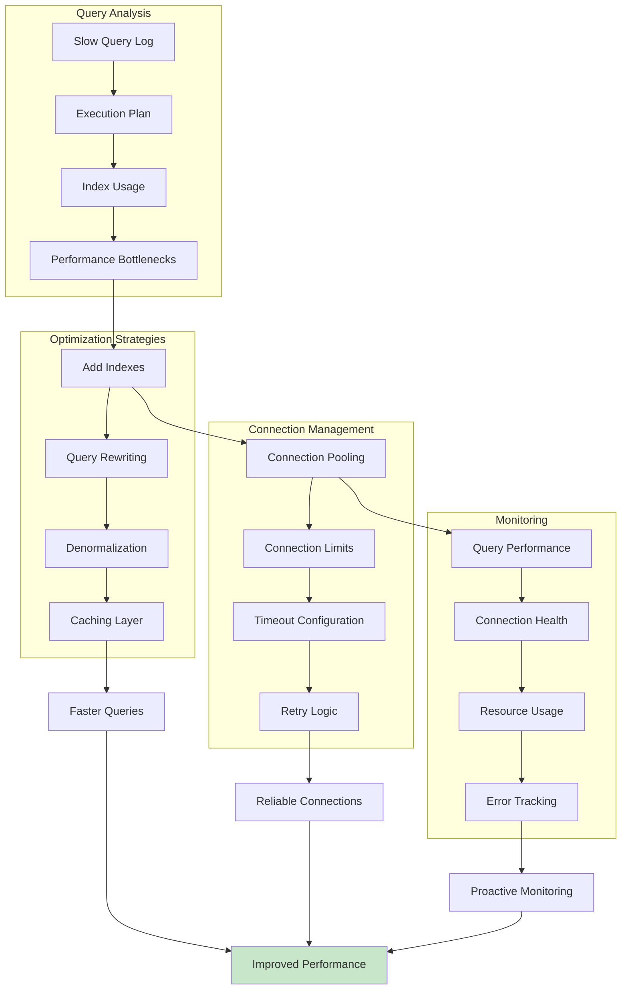

## CDN Performance Optimization

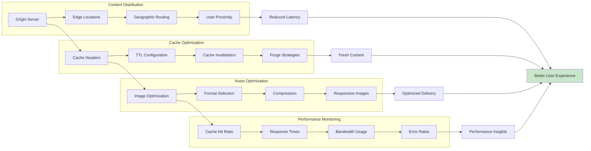
