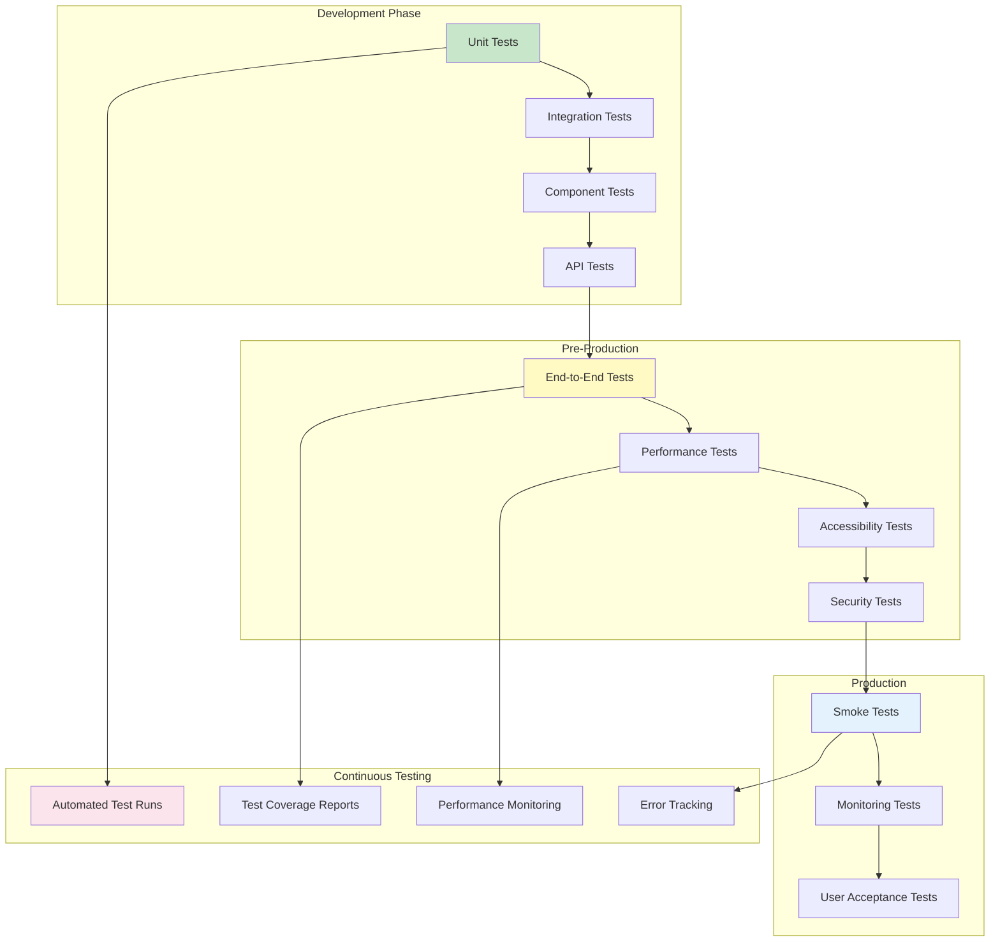
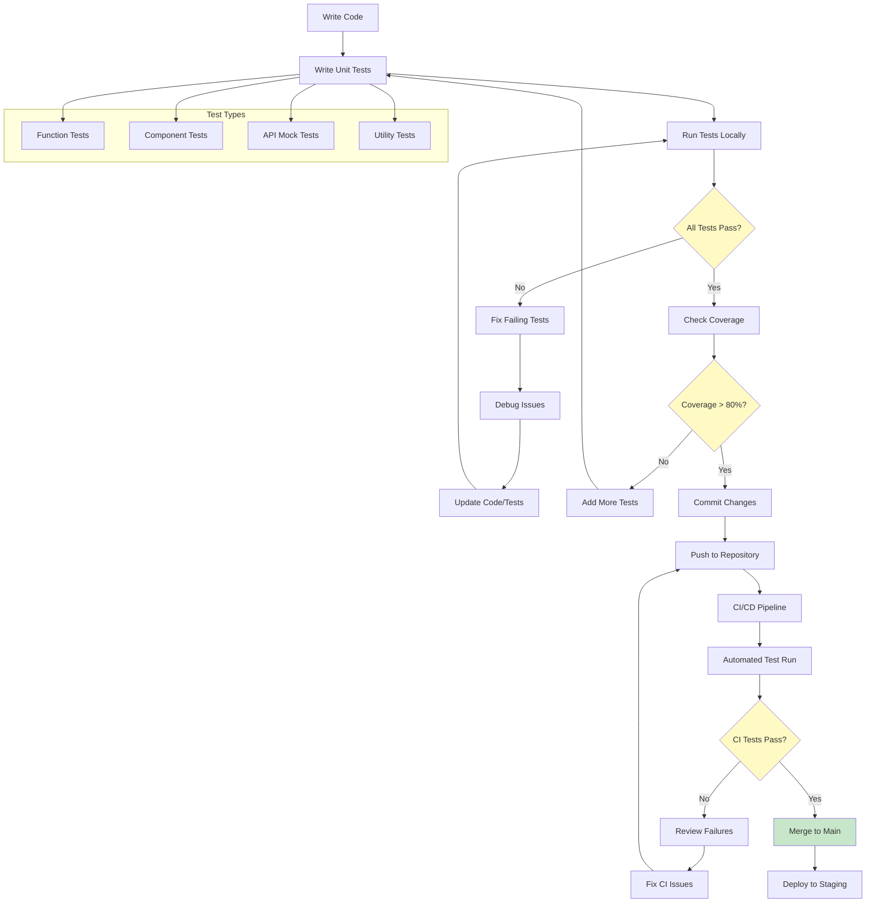
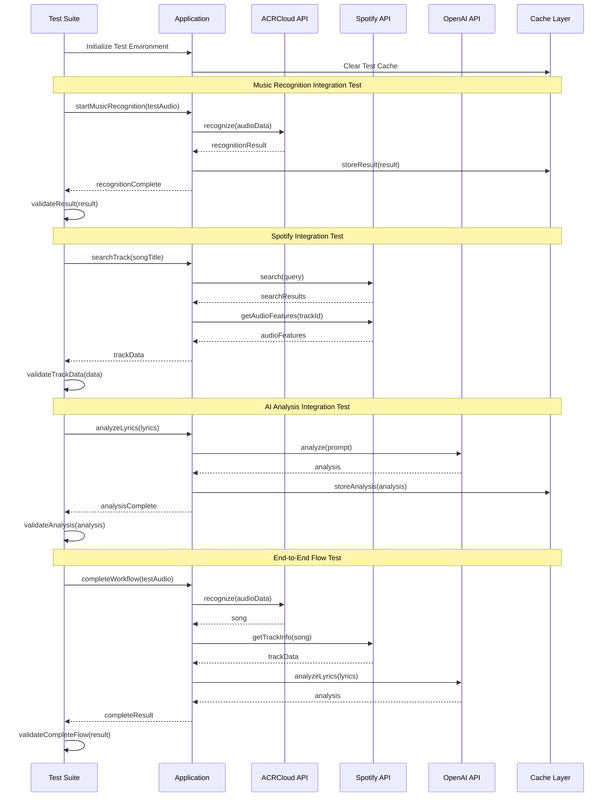
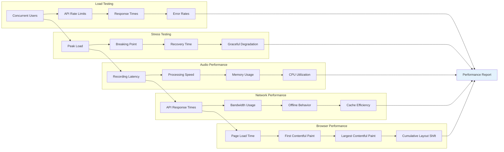
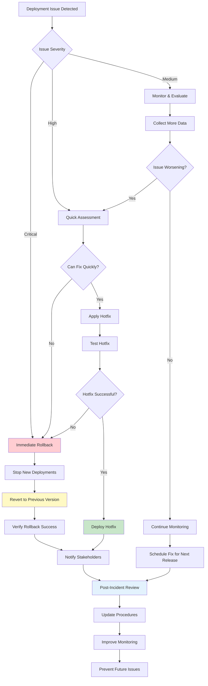
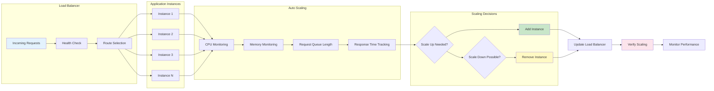
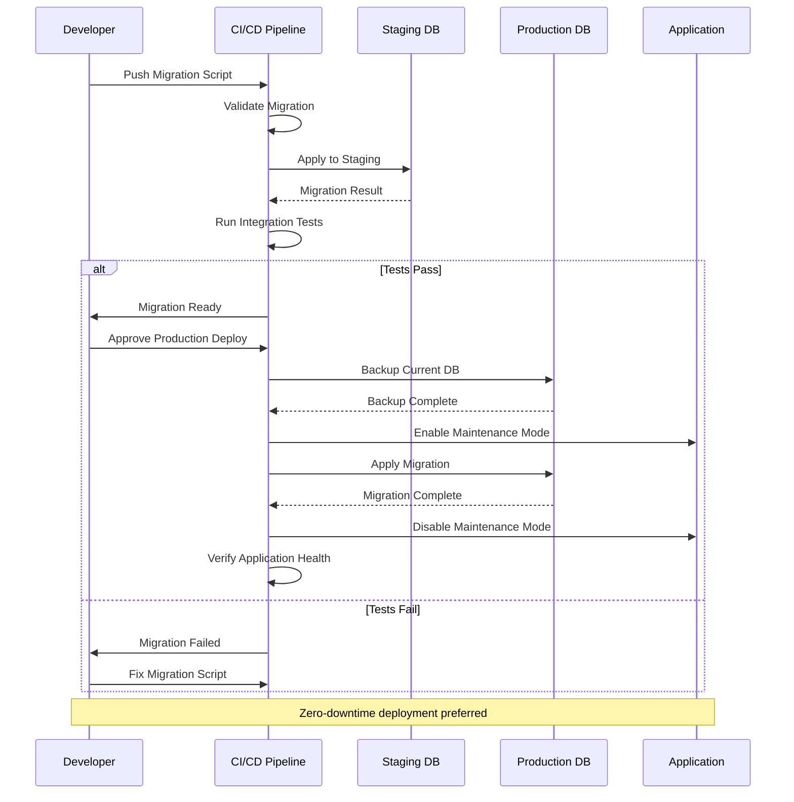
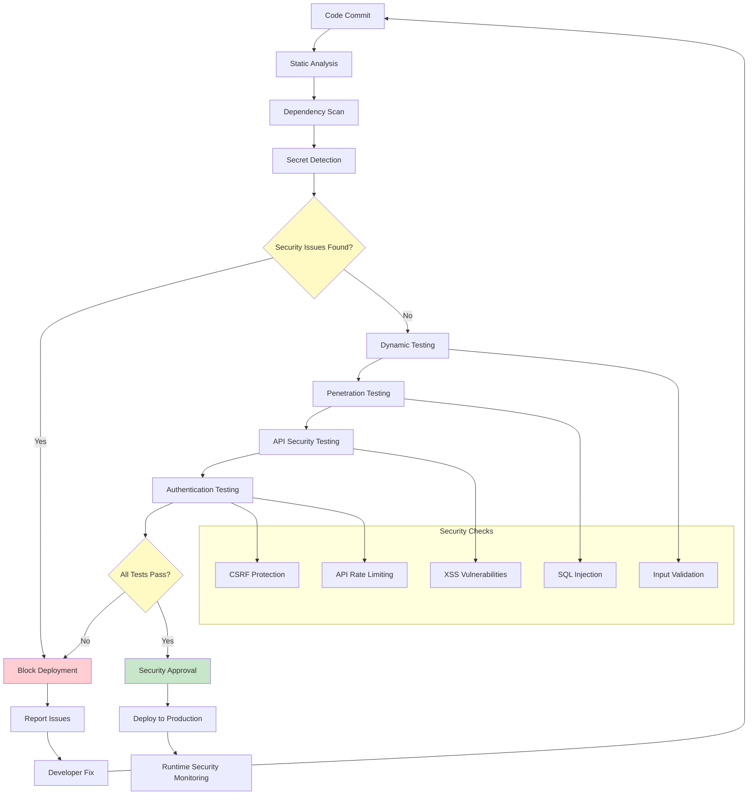
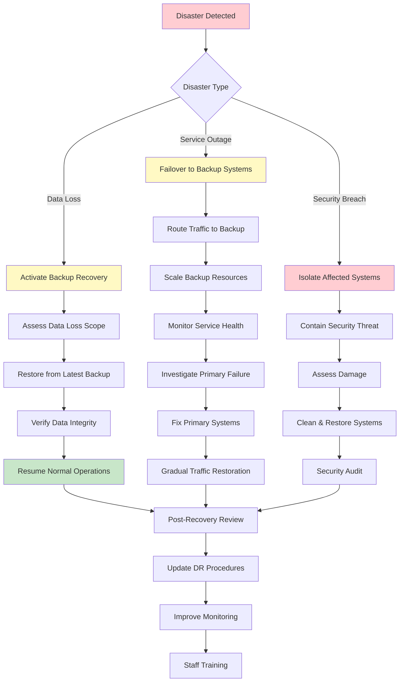

# 🧪 Testing & Deployment Workflow Diagrams

## Testing Strategy Overview



## Unit Testing Workflow



## Integration Testing Flow



## Performance Testing Strategy



## Deployment Pipeline

```mermaid
gitgraph
    commit id: "Feature Development"
    
    branch feature/music-recognition
    checkout feature/music-recognition
    commit id: "Implement Audio Recording"
    commit id: "Add ACRCloud Integration"
    commit id: "Unit Tests"
    
    checkout main
    merge feature/music-recognition
    commit id: "Integration Tests"
    
    branch staging
    checkout staging
    merge main
    commit id: "Deploy to Staging"
    commit id: "E2E Tests"
    commit id: "Performance Tests"
    
    branch production
    checkout production
    merge staging
    commit id: "Production Deploy"
    commit id: "Smoke Tests"
    commit id: "Monitor & Verify"
    
    checkout main
    commit id: "Hotfix if needed"
    
    checkout production
    merge main
    commit id: "Hotfix Deploy"
```

## CI/CD Pipeline Flow

```mermaid
flowchart TD
    A[Code Push] --> B[Trigger CI/CD]
    B --> C[Checkout Code]
    C --> D[Install Dependencies]
    
    D --> E[Lint Code]
    E --> F{Linting Passed?}
    F -->|No| G[Report Lint Errors]
    F -->|Yes| H[Run Unit Tests]
    
    H --> I{Tests Passed?}
    I -->|No| J[Report Test Failures]
    I -->|Yes| K[Build Application]
    
    K --> L{Build Successful?}
    L -->|No| M[Report Build Errors]
    L -->|Yes| N[Run Integration Tests]
    
    N --> O{Integration Tests Passed?}
    O -->|No| P[Report Integration Failures]
    O -->|Yes| Q[Security Scan]
    
    Q --> R{Security Scan Passed?}
    R -->|No| S[Report Security Issues]
    R -->|Yes| T[Deploy to Staging]
    
    T --> U[Run E2E Tests]
    U --> V{E2E Tests Passed?}
    V -->|No| W[Report E2E Failures]
    V -->|Yes| X[Performance Tests]
    
    X --> Y{Performance OK?}
    Y -->|No| Z[Report Performance Issues]
    Y -->|Yes| AA[Deploy to Production]
    
    AA --> BB[Smoke Tests]
    BB --> CC{Smoke Tests Passed?}
    CC -->|No| DD[Rollback Deployment]
    CC -->|Yes| EE[Monitor Application]
    
    G --> FF[Notify Developers]
    J --> FF
    M --> FF
    P --> FF
    S --> FF
    W --> FF
    Z --> FF
    DD --> FF
    
    EE --> GG[Deployment Complete]
    
    style F fill:#ffcdd2
    style I fill:#ffcdd2
    style L fill:#ffcdd2
    style O fill:#ffcdd2
    style R fill:#ffcdd2
    style V fill:#ffcdd2
    style Y fill:#ffcdd2
    style CC fill:#ffcdd2
    style GG fill:#c8e6c9

## Monitoring & Alerting System

```mermaid
graph TB
    subgraph "Application Metrics"
        A[Response Times] --> B[Error Rates]
        B --> C[Throughput]
        C --> D[Resource Usage]
    end
    
    subgraph "Business Metrics"
        E[Recognition Success Rate] --> F[User Engagement]
        F --> G[API Usage Costs]
        G --> H[Feature Adoption]
    end
    
    subgraph "Infrastructure Metrics"
        I[Server Health] --> J[Database Performance]
        J --> K[Network Latency]
        K --> L[Storage Usage]
    end
    
    subgraph "Alert Conditions"
        M[Error Rate > 5%] --> N[Response Time > 3s]
        N --> O[API Failures > 10%]
        O --> P[Memory Usage > 80%]
    end
    
    A --> M
    B --> M
    C --> N
    D --> P
    
    M --> Q[Send Alert]
    N --> Q
    O --> Q
    P --> Q
    
    Q --> R[Notify Team]
    Q --> S[Auto-Scale Resources]
    Q --> T[Circuit Breaker]
    
    style Q fill:#ffcdd2
    style R fill:#fff9c4
    style S fill:#e3f2fd
    style T fill:#fce4ec
```

## Rollback Strategy



## Load Balancing & Scaling



## Database Migration Strategy



## Security Testing Pipeline



## Disaster Recovery Plan


