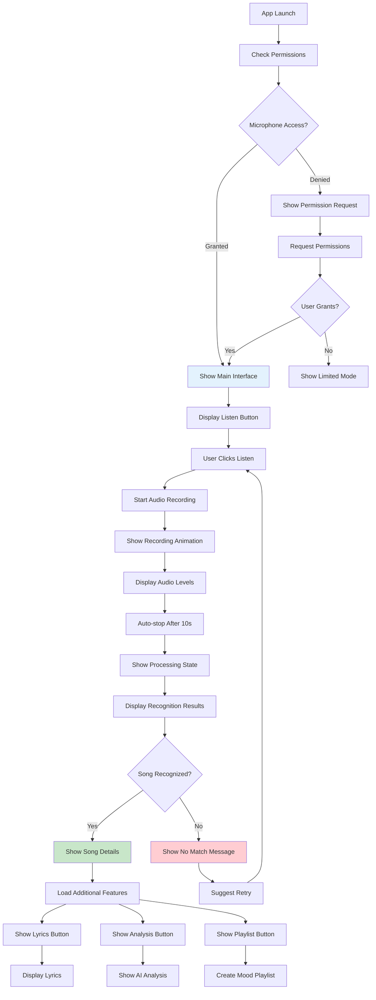
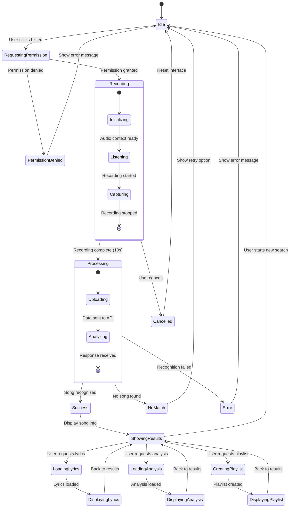
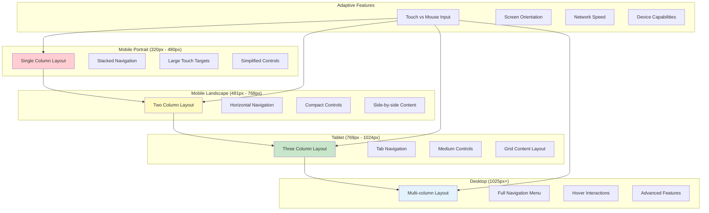
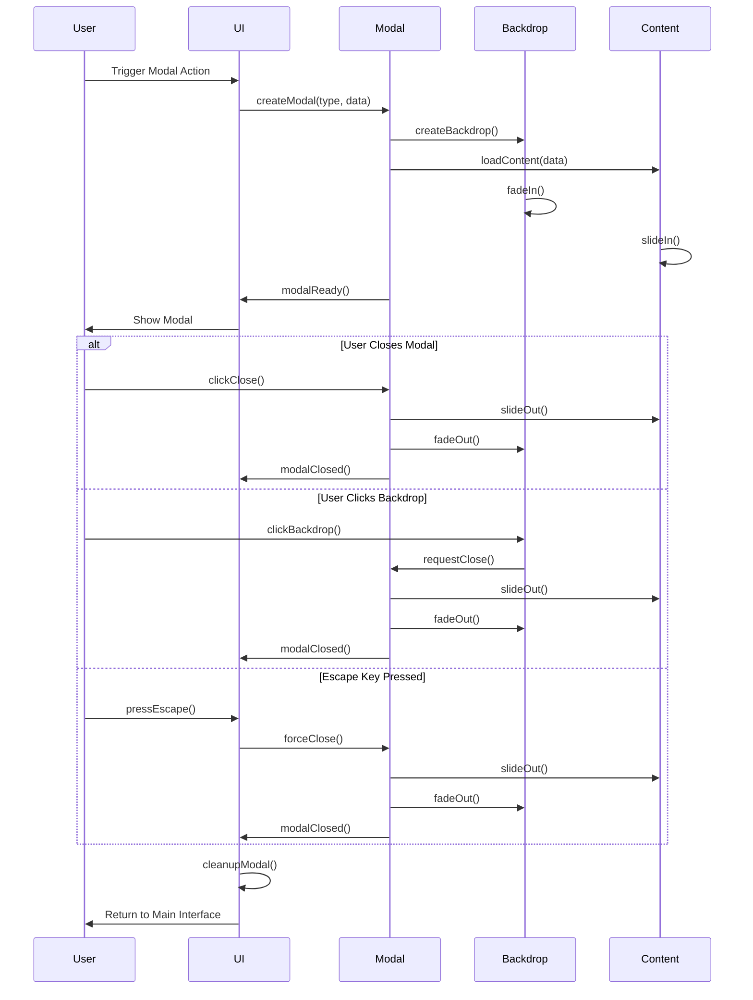
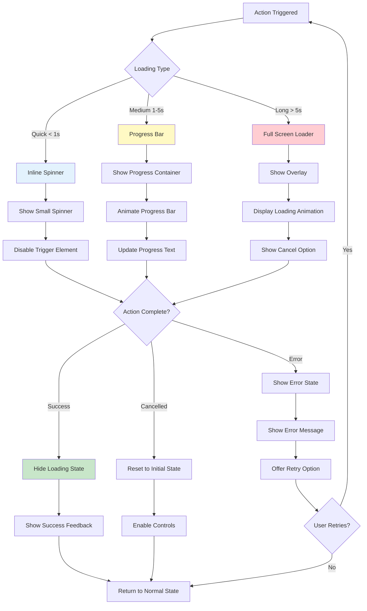
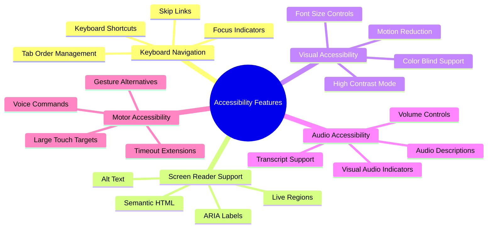
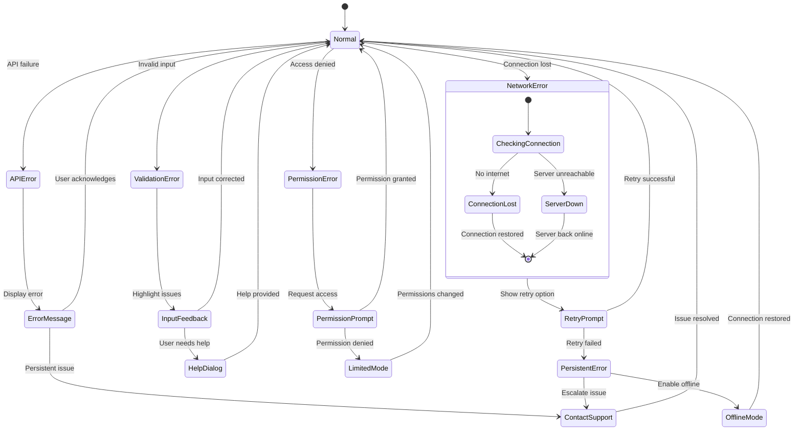
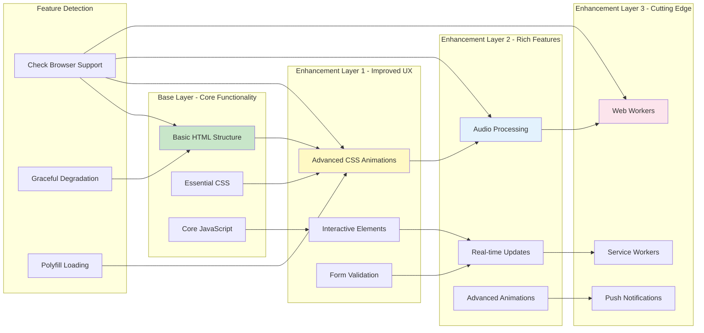
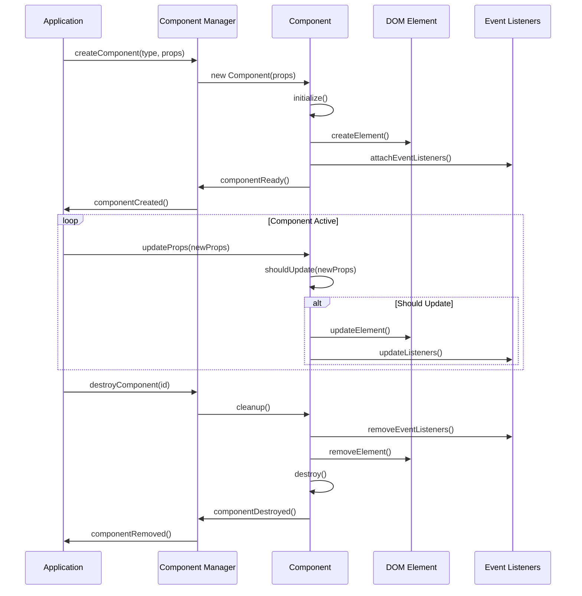

# 🎨 User Interface & Experience Flowcharts

## Main Application User Flow

## Audio Recording Interface States

## Responsive Design Breakpoints

## Theme Management System

```mermaid
flowchart LR
    A[User Preference] --> B{Theme Setting}
    
    B -->|Light| C[Light Theme Variables]
    B -->|Dark| D[Dark Theme Variables]
    B -->|Auto| E[System Preference Check]
    
    E --> F{System Theme}
    F -->|Light| C
    F -->|Dark| D
    
    C --> G[Apply Light Colors]
    D --> H[Apply Dark Colors]
    
    G --> I[Update CSS Variables]
    H --> I
    
    I --> J[Animate Transition]
    J --> K[Save Preference]
    K --> L[Update UI Elements]
    
    subgraph "Theme Variables"
        M[Background Colors]
        N[Text Colors]
        O[Accent Colors]
        P[Border Colors]
        Q[Shadow Values]
    end
    
    I --> M
    I --> N
    I --> O
    I --> P
    I --> Q
    
    subgraph "UI Updates"
        R[Navigation Bar]
        S[Content Areas]
        T[Buttons & Controls]
        U[Modal Dialogs]
        V[Loading States]
    end
    
    L --> R
    L --> S
    L --> T
    L --> U
    L --> V
    
    style C fill:#fff9c4
    style D fill:#424242
    style J fill:#e3f2fd
```

## Modal Dialog Management

## Loading States & Animations

## Accessibility Features Flow

## Error State Management

## Progressive Enhancement Strategy

## Component Lifecycle Management

